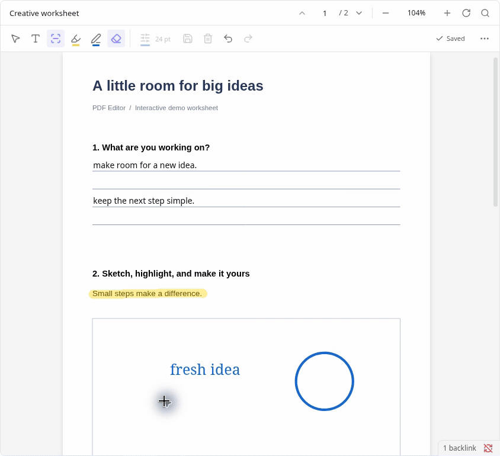
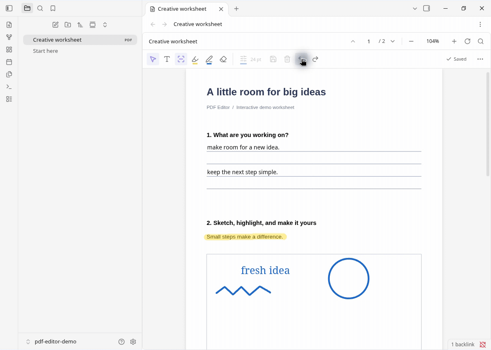

# PDF Editor (Beta)

Fill forms, type on worksheets, highlight and draw directly in Obsidian PDF embeds and tabs. Text stays editable in the PDF; drawings save as standard ink annotations for other viewers and printing.

**Desktop beta · 0.7.11 · Installed ID: `pdf-form-studio`**

> **Edit each PDF in one place at a time.** Wait for **Saved** and let vault sync finish before switching apps or devices. Another writer can still overwrite, or be overwritten by, a save. Keep a separate backup of important PDFs.

## Write and fill answers

- Edit existing text fields, or choose **Text (T)** and click or drag to add a box. Select a box to move or resize it; double-click or press Enter to type.
- Use **Detect answer lines** to find printed rules, underscores and regular dotted lines. Click a blue suggestion to answer; consecutive lines can become one wrapping answer block. Detection alone never changes the PDF.
- Choose Sans, Serif or Mono, a text size and a color. Tab moves between detected answers. Text boxes wrap and grow within the page.


## Draw, highlight and hold for shapes

- **Pen (P)** draws with optional smoothing; **Highlighter (H)** adds transparent strokes. **Eraser (E)** removes a whole owned stroke.
- Enable **Draw & hold shapes** in Pen settings, draw a line, rectangle, triangle, ellipse/circle or arrow, then pause at the endpoint. Keep holding to resize; lift to finish. Uncertain shapes stay freehand.
- Hold a highlighter stroke still to straighten it, or start with Shift for a horizontal line. The settings button beside each tool opens colors, widths and a brush preview.


## Select, rearrange and undo

- **Select (V)** lets you select printed text and follow links. Drag from blank space to select your boxes and drawings together; Shift-click changes the selection.
- Move a selection by dragging or using arrow keys. Cmd/Ctrl+C, V and D copy, paste and duplicate editable objects; Delete removes them. Ordinary pasted text can become a new text box.
- **Undo/Redo** keeps 50 editing actions per session, including saved edits. Outside text inputs, use Cmd/Ctrl+Z and Shift+Cmd/Ctrl+Z. Escape cancels a gesture or clears the selection.



## Navigate and save

- Use the header for page navigation, fit-width zoom, rotation and text search. Click the filename to rename the PDF in its current vault folder.
- Turn on **Floating toolbar** in PDF options to keep navigation and editing tools visible while scrolling a note. Settings also provide a top offset and optional answer-line detection on open.
- Edits save automatically after a pause. **Saved** means the vault PDF was written and read back successfully. Use the disk button or Cmd/Ctrl+S to save now; the page and selection stay in place.



## Work inside your notes

Use the editor in a PDF tab, a normal `![[worksheet.pdf]]` embed in Reading view or Live Preview, or a pop-out window. Existing `#page=` and numeric `#height=` embed options are respected.


## Recovery and privacy

**Keep original copies for new PDFs** is on by default. It retains one verified whole-PDF original before the first overwrite, rather than a copy of every edit. Turning it off keeps existing originals; turning it on later cannot recreate an earlier version.

Use **PDF options → Recovery copies…** to inspect copies, **Preview original PDF** to view one, and **Restore original backup…** to restore it after confirmation. **Undo last restore…** reverses that restore using a verified before-restore copy. **Export pending PDF recovery draft** saves a retained draft beside the source under a new filename, including when the source is damaged.

Temporary recovery drafts remain active even with original copies off. A draft is durable only after its checkpoint succeeds; a crash before that point can lose recent edits. Interrupted file/folder moves can leave recovery copies associated with an old path. Real power-loss and disk-failure recovery are not established.

Everything stays in the vault: no network requests, telemetry or account. Recovery data lives under `.obsidian/plugins/pdf-form-studio/recovery` (or the vault's configured settings directory). Hidden recovery files may not be covered by your sync settings. Copy them separately when moving a vault or reinstalling; deleting the plugin folder deletes its local recovery data. Settings show storage use and provide guarded cleanup. Originals have no automatic expiry; do not manually delete indexed copies or downgrade with unsaved edits.

## Current limits

- **Single writer:** external-change checks reduce conflicts, but Obsidian's write API cannot atomically reject a concurrent update. Large PDFs are rewritten in full on save and can use substantial memory.
- **PDF support:** encrypted, XFA, signature-bearing and malformed PDFs, including duplicate field names, are rejected for editing. Unsupported documents return to Obsidian's native viewer. Read-only, password, rich-text, hidden and locked fields retain their original appearance.
- **Editing scope:** printed text cannot be rewritten. Existing authored fields keep their geometry. Checkbox, radio and dropdown changes are not saved. Only this plugin's drawings can be moved or erased here; unrelated annotations are preserved.
- **Ink and detection:** constant-width strokes, no pressure sensitivity, OCR or handwriting recognition. Physical stylus/Wacom testing is outstanding. Answer-line detection is a raster heuristic and can miss noisy scans or table cells. Manual scans cover at most 100 pages per action; automatic scanning defaults to a 25-page limit.
- **Text and viewer:** whole-field formatting, no CJK/emoji font fallback; unsupported glyphs cause a save error. Text can clip at the page edge. Native outlines, thumbnails and some context-menu/subpath behavior are not reproduced. Search requires existing PDF text.
- **Compatibility:** the native-host adapter uses undocumented Obsidian internals. The checks below cover specific desktop versions and actions; broad third-party plugin compatibility is not established.

## Install

This is not yet a published Community plugin. Version 0.7.11 is prepared locally, with no published tag or release. Copy `main.js`, `manifest.json` and `styles.css` from your build into `.obsidian/plugins/pdf-form-studio/`, then enable **PDF Editor (Beta)** in Community plugins. Existing settings use the same plugin ID.

## Build and test

Use Node.js 24 and an isolated development vault:

```sh
npm ci
npm run check
npm run test:stress
npm run install:dev -- "/absolute/path/to/initialized-development-vault"
```

`check` runs lint, tests, TypeScript, the production build and metadata validation. The installer copies the three plugin assets without enabling the plugin. Reload Obsidian after rebuilding; `npm run dev` watches source.

## Verified scope

| Desktop app | Evidence |
| --- | --- |
| Linux · Obsidian 1.14.4 | Actual UI checks in PDF tabs, Live Preview, Reading view and pop-outs. Covered text/answer detection, formatting, text and mixed-object selection, move/duplicate, deletion, undo/redo, ink/highlighter/eraser, held circle, navigation/zoom/rotation/search, and original preview/restore/undo restore. |
| Linux · Obsidian 1.13.7 | Narrower smoke pass: startup/rendering, existing text edits, new ink, saving, page navigation, answer-line detection/typing and reopening in Live Preview and Reading embeds. |
| macOS · Obsidian 1.14.4 | User-confirmed use; not independently rerun in this verification pass. |

The Linux checks ran on 2026-10-09. Saved fields and ink were independently inspected, and restoring the original reproduced its SHA-256 checksum. The declared desktop minimum remains **1.13.7**. No Windows or mobile compatibility claim.

**204 tests and 4 stress workloads passed**, along with lint, TypeScript and build; the dependency audit reported **0 known vulnerabilities** on 2026-10-09. These checks do not establish physical pen behavior, power-loss durability or unrestricted PDF compatibility.

Exact `x.y.z` tags create **draft** releases. Release publication and Community submission still need a distribution decision and broader testing.

## License

Original code is [MIT licensed](LICENSE). PDF-LIB, fontkit and Perfect Freehand are bundled; rendering uses Obsidian's PDF.js. Bundled Noto fonts use the SIL OFL. [Third-party notices](THIRD_PARTY_NOTICES.txt) are included in the build.
