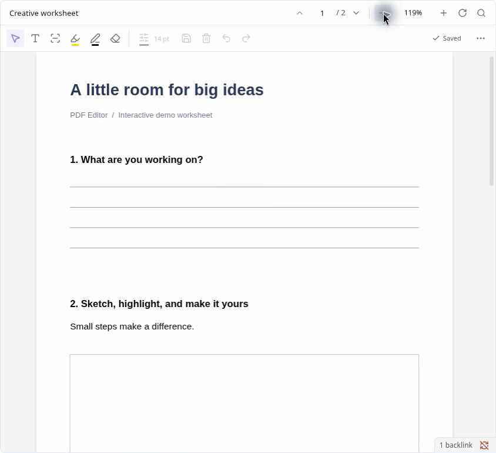
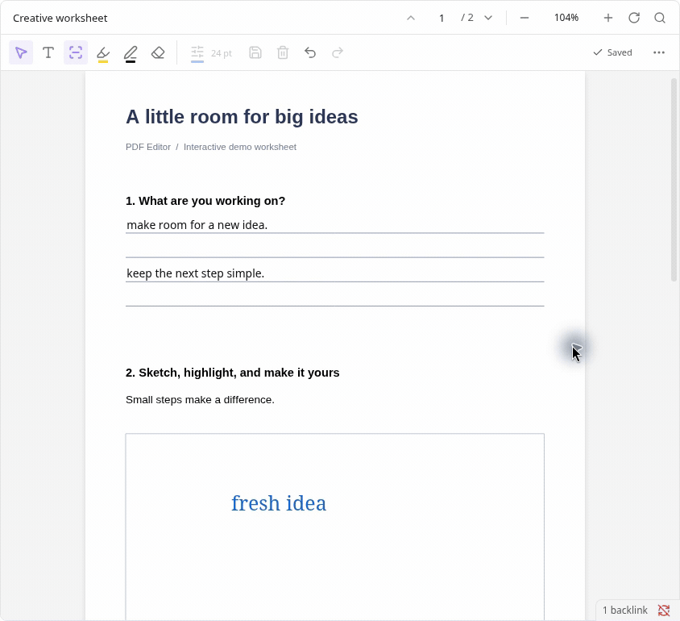
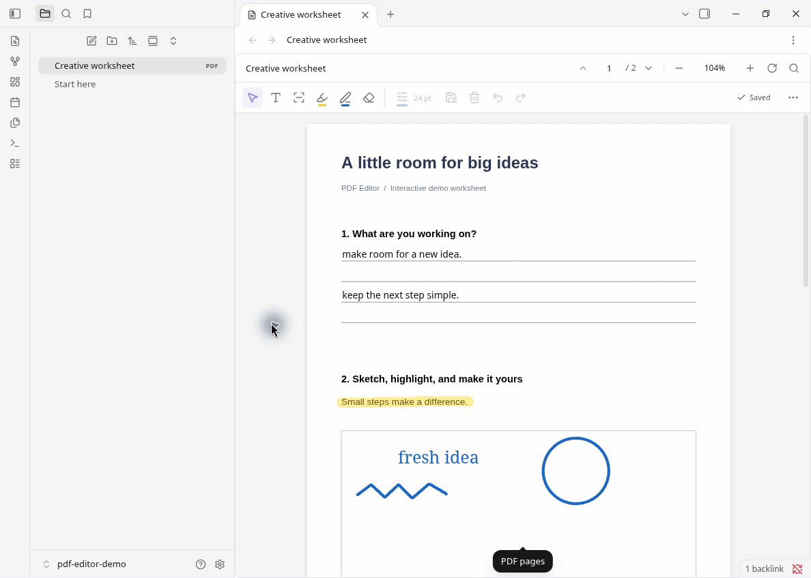

# PDF Editor (Beta)

Write, fill answers, highlight and draw on PDFs without leaving Obsidian. Works in PDF tabs, notes and pop-out windows.

### Write and fill answers

### Draw and highlight

### Edit inside your notes

## Get started

[View the Community listing](https://community.obsidian.md/plugins/pdf-form-studio). If it isn’t available in your app yet, copy `main.js`, `manifest.json` and `styles.css` from the [latest release](https://github.com/holtsdav/PDF_Editor/releases/latest) into `.obsidian/plugins/pdf-form-studio/`, then enable **PDF Editor (Beta)**.

Desktop only, Obsidian **1.13.7+**. Tested on Linux 1.14.4, with a basic check on 1.13.7; macOS 1.14.4 is user-confirmed. Windows and mobile are unverified.

**Beta:** keep backups and edit each PDF in only one app or device at a time. Wait for **Saved** and sync to finish before switching. Existing printed text cannot be rewritten; not every PDF is supported.

[MIT license](LICENSE) · [Third-party credits and licenses](THIRD_PARTY_NOTICES.txt)
